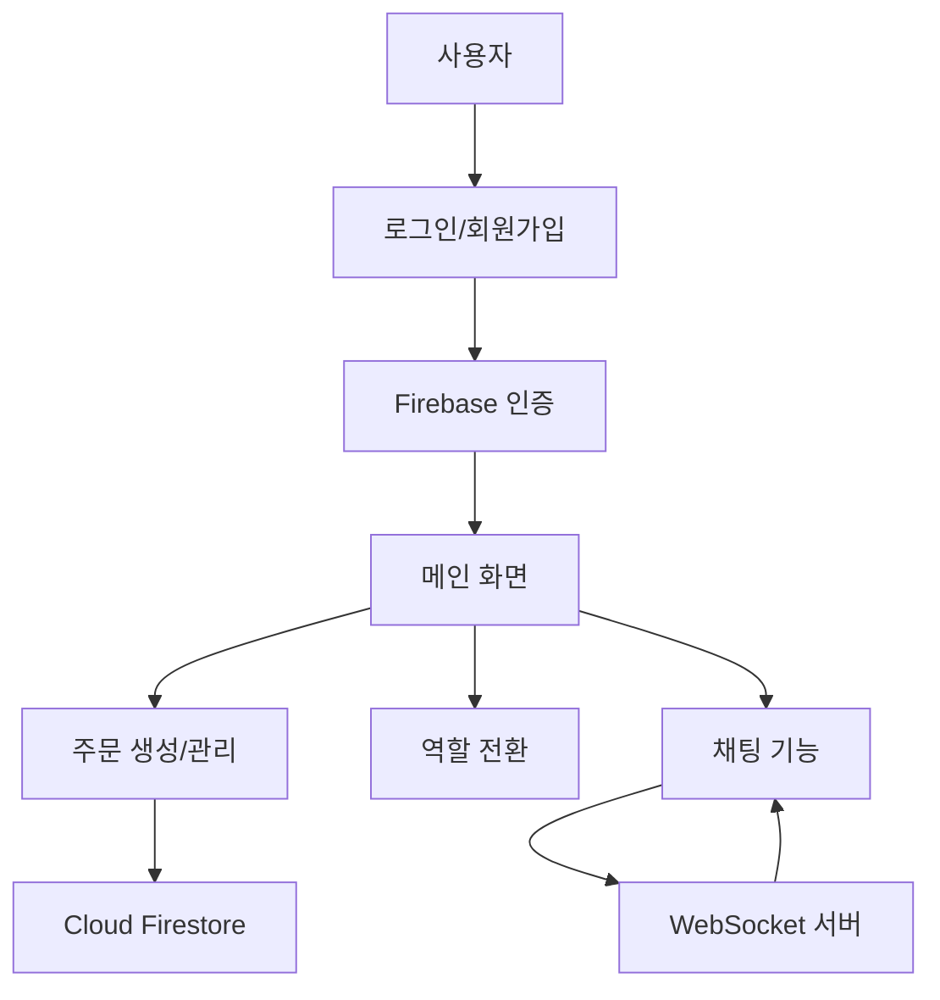

# 🚚 ChatWithRider - 배달 매칭 및 소통 앱

## 📌 프로젝트 소개
ChatWithRider는 손님과 배달원(라이더) 간의 매칭 및 실시간 소통을 위한 Flutter 기반 모바일 애플리케이션입니다. Firebase 인증 및 Firestore를 활용하여 사용자 관리와 주문 처리를 구현하고, WebSocket을 통한 실시간 채팅 기능을 제공합니다.

## 🎯 주요 기능
- 구글 계정을 이용한 간편한 로그인/회원가입
- 손님과 배달원 역할 간 자유로운 전환
- 위치 기반 주문 생성 및 관리
- WebSocket을 활용한 실시간 채팅
- 직관적인 사용자 정보 및 주문 관리

## 🛠 기술 스택
- **Frontend**: Flutter, Dart
- **Backend**: 
  - Firebase Authentication (사용자 인증)
  - Cloud Firestore (데이터베이스)
  - WebSocket (실시간 채팅)
- **인증**: Google Sign-In

## 📁 프로젝트 구조
chatrider/
├── lib/
│ ├── main.dart # 앱 진입점 및 Firebase 초기화
│ ├── firebase_options.dart # Firebase 구성 (gitignore에 포함)
│ └── screens/
│ ├── login_screen.dart # 로그인 화면
│ ├── signup_screen.dart # 회원가입 화면
│ ├── home_screen.dart # 메인 홈 화면
│ ├── chat_screen.dart # 실시간 채팅 화면
│ └── orderlist_screen.dart # 주문 목록 화면
├── assets/
│ └── logo.png # 앱 로고
├── android/ # 안드로이드 플랫폼 구성
├── ios/ # iOS 플랫폼 구성
└── pubspec.yaml # 의존성 관리

## 🔍 시스템 아키텍처


## ⚙️ 설치 방법
1. Flutter SDK 설치 및 설정
```bash
flutter doctor
```

2. 프로젝트 클론 및 의존성 설치
```bash
git clone https://github.com/DONALDSUK/ChatWIthRider.git
cd ChatWIthRider
flutter pub get
```

3. Firebase 설정
- [Firebase 콘솔](https://console.firebase.google.com/)에서 프로젝트 생성
- FlutterFire CLI를 통한 앱 구성:
```bash
dart pub global activate flutterfire_cli
flutterfire configure
```

4. 앱 실행
```bash
flutter run
```

## 💻 주요 기능 상세 설명
### 1. 사용자 인증 시스템 (`login_screen.dart`, `signup_screen.dart`)
- Google 계정을 활용한 간편 로그인
- 사용자 정보 등록 및 관리
- 안전한 인증 프로세스

### 2. 역할 기반 기능
- 손님 모드: 주문 생성, 배달 상태 확인
- 배달원 모드: 주문 확인 및 수락, 배달 진행
- 한 계정으로 두 역할 간 자유로운 전환

### 3. 실시간 채팅 시스템 (`chat_screen.dart`)
- WebSocket을 활용한 실시간 메시지 교환
- 사용자 친화적 채팅 인터페이스
- 배달 진행 상황에 대한 원활한 소통

### 4. 주문 관리 시스템 (`orderlist_screen.dart`)
- 실시간 주문 목록 조회
- 주문 상태 추적
- 배달원과 손님 간 매칭

## 🌟 핵심 구현 사항
1. **사용자 경험 최적화**
   - 직관적인 UI/UX 디자인
   - 다크 테마 적용
   - 부드러운 화면 전환 및 애니메이션

2. **Firebase 통합**
   - 사용자 인증 및 계정 관리
   - 실시간 데이터베이스 연동
   - 주문 정보 안전한 저장 및 관리

3. **실시간 통신**
   - WebSocket을 통한 즉각적인 메시지 전달
   - 주문 상태 실시간 업데이트
   - 연결 안정성 관리

## 🔧 개발 환경
- Flutter 3.x+
- Dart 3.x+
- Android Studio / VS Code
- Firebase 계정

## 🎉 프로젝트 특징
- 직관적인 사용자 인터페이스
- 역할 전환 시스템을 통한 유연한 사용자 경험
- 실시간 채팅으로 손님-라이더 간 원활한 소통
- Firebase 기반의 안정적인 백엔드 아키텍처
- 확장 가능한 주문 관리 시스템

## 👨‍💻 개발자
- [DONALDSUK](https://github.com/DONALDSUK)